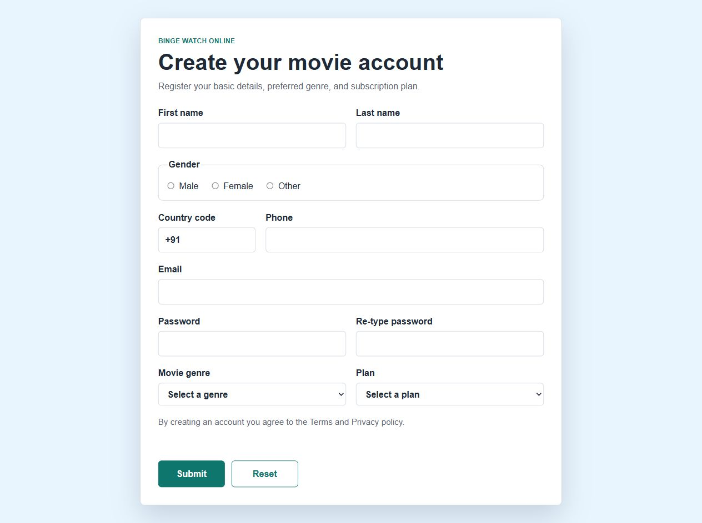
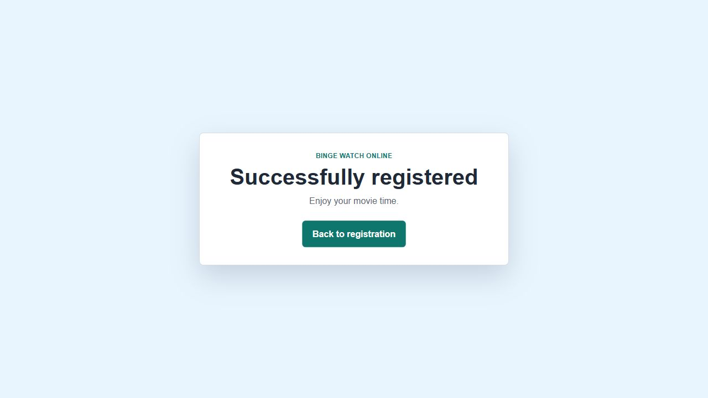

# Binge Watch Online - AWS Cloud Deployment Project

This is a small AWS deployment project for a static entertainment website. The website itself is simple HTML, CSS, and JavaScript. The main work is deploying it properly using S3, CloudFront, Route 53, and EC2.

I made this as a practical cloud project, not a big production setup.

## What this project deploys

- S3 bucket for static website files
- CloudFront distribution in front of the S3 bucket
- optional Route 53 alias record for a custom domain
- separate S3 bucket for teammate file sharing
- IAM role for EC2 to access the S3 buckets
- optional Amazon Linux EC2 VM for testing S3 access

## Folder structure

```text
architecture/
  simple-architecture.md
deployment/
  cloudformation/binge-watch-online.yaml
  config.example.json
  scripts/deploy-stack.ps1
  scripts/sync-website.ps1
  scripts/test-ec2-s3-access.sh
docs/
  architecture.md
  deployment-guide.md
screenshots/
  registration-form.png
  thank-you-page.png
website/
  index.html
  script.js
  styles.css
  thankyou.html
```

## Architecture

```text
User -> Route 53 -> CloudFront -> S3 website bucket

EC2 VM -> S3 website bucket
EC2 VM -> S3 team share bucket
```

CloudFront is used because users may visit the site from different countries. Instead of every request going back to one server, CloudFront can serve cached files from edge locations.

## Before running

You need:

- AWS CLI installed
- AWS credentials configured
- PowerShell
- bucket names that are globally unique

Copy the config example:

```powershell
Copy-Item .\deployment\config.example.json .\deployment\config.json
```

Then edit `deployment/config.json` and change at least:

```json
"WebsiteBucketName": "your-unique-website-bucket",
"TeamShareBucketName": "your-unique-team-share-bucket"
```

If you do not have a domain yet, leave Route 53 values empty. The CloudFront URL will still work.

## Deploy AWS resources

Run this from the repository root:

```powershell
.\deployment\scripts\deploy-stack.ps1
```

This creates the AWS resources using CloudFormation.

## Upload the website

After the stack is created, upload the files from `website/`:

```powershell
.\deployment\scripts\sync-website.ps1
```

If the site was already cached in CloudFront and you updated files, run:

```powershell
.\deployment\scripts\sync-website.ps1 -Invalidate
```

## Route 53

If a domain is available, add these values in `deployment/config.json`:

```json
"HostedZoneId": "YOUR_HOSTED_ZONE_ID",
"DomainName": "www.yourdomain.com",
"AcmCertificateArn": "YOUR_US_EAST_1_CERTIFICATE_ARN"
```

CloudFront needs the ACM certificate to be in `us-east-1`.

## EC2 and storage test

The template creates an EC2 IAM role even if the VM is not launched. To launch the VM, set this in config:

```json
"CreateEc2": "true",
"VpcId": "vpc-xxxx",
"SubnetId": "subnet-xxxx",
"KeyName": "your-key-name",
"AdminCidr": "your-ip/32"
```

After connecting to the EC2 instance, the storage access can be tested with:

```bash
./test-ec2-s3-access.sh website-bucket-name team-share-bucket-name
```

## Cost notes

For a student project, I would keep an AWS Budget alert on the account and stop the EC2 instance when I am not using it. Most of the cost should be small, but Route 53 hosted zones, EC2 running time, CloudFront traffic, and S3 requests can still add up.

## Screenshots

Registration page:



Thank you page:



## Notes

I kept the frontend simple on purpose. This project is mainly about cloud deployment and CDN delivery, not making a new React app or adding extra tools that are not needed for the assignment.
