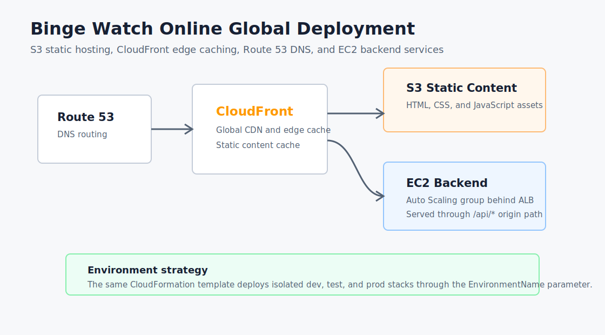

# AWS Global Website Deployment

Binge Watch Online is a static movie account registration site with AWS infrastructure for global delivery. Static assets are hosted in Amazon S3, distributed through CloudFront, routed with Route 53, and paired with EC2 backend services behind a load balancer.

## Features

- Static Binge Watch Online registration website
- S3 bucket for private static content hosting
- CloudFront distribution for edge caching and global delivery
- EC2 backend service behind an Application Load Balancer
- Route 53 alias record support for a custom domain
- Dev, test, and prod deployment support through CloudFormation parameters

## Tech Stack

- HTML5
- CSS3
- JavaScript
- AWS CloudFormation
- Amazon S3
- Amazon CloudFront
- Amazon Route 53
- Amazon EC2
- Elastic Load Balancing
- Auto Scaling
- PowerShell

## Project Structure

```text
aws-global-website-deployment/
|-- assets/
|   |-- architecture.svg
|   |-- registration-form.png
|   `-- thank-you-page.png
|-- cloudformation/
|   `-- global-website.yml
|-- scripts/
|   |-- deploy-environment.ps1
|   `-- sync-static-content.ps1
|-- src/
|   |-- index.html
|   |-- script.js
|   |-- styles.css
|   `-- thankyou.html
`-- README.md
```

## Setup

Prerequisites:

- AWS account with access to EC2, S3, CloudFront, Route 53, CloudFormation, Elastic Load Balancing, and Auto Scaling
- AWS CLI configured locally
- Existing VPC and at least two public subnets
- PowerShell

Deploy an environment:

```powershell
cd scripts
.\deploy-environment.ps1 `
  -StackName binge-watch-dev `
  -EnvironmentName dev `
  -VpcId vpc-xxxxxxxx `
  -SubnetIds "subnet-xxxxxxxx,subnet-yyyyyyyy" `
  -Region us-east-1
```

Sync the static website to the S3 bucket returned by the stack output:

```powershell
.\sync-static-content.ps1 `
  -BucketName binge-watch-online-dev-static-bucket `
  -Region us-east-1
```

Deploy test and production with the same template by changing `EnvironmentName` and `StackName`.

## Architecture

The CloudFormation template creates a private S3 bucket for static files and exposes it through CloudFront using origin access control. CloudFront serves static assets from S3 and routes `/api/*` requests to an Application Load Balancer connected to an EC2 Auto Scaling group.

Route 53 support is included for custom domains through optional `DomainName` and `HostedZoneId` parameters. The same stack can be deployed independently for development, testing, and production.

## Screenshots

Architecture:



Registration page:


Confirmation page:


